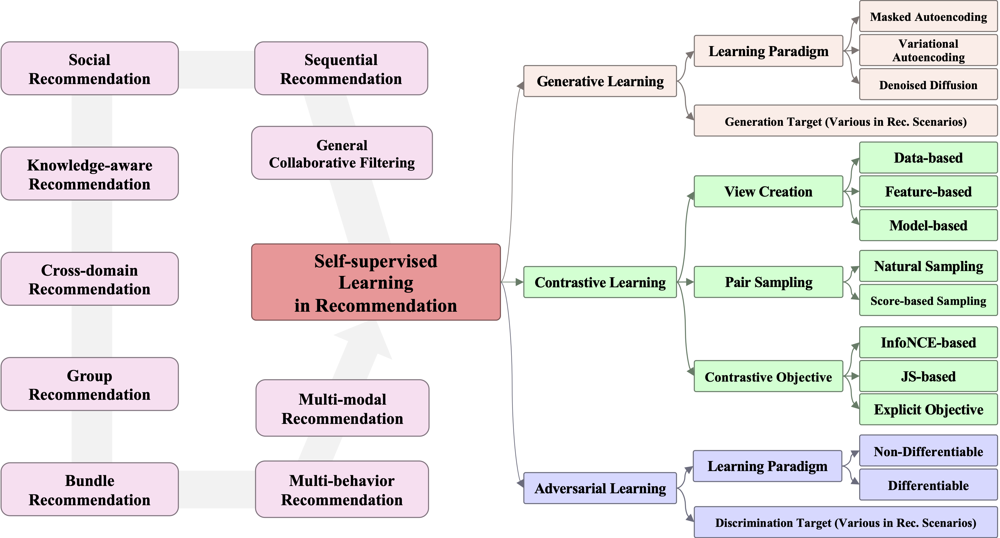
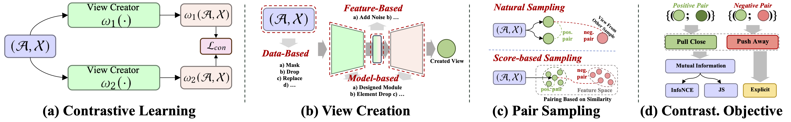
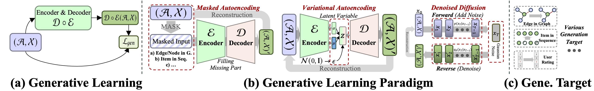
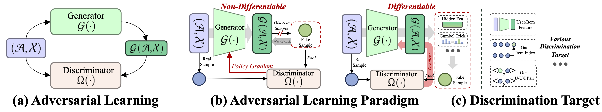

# Awesome-SSLRec-Papers
[](https://github.com/HKUDS/Awesome-SSLRec-Papers)
 


A collection of papers and resources about self-supervised learning (**SSL**) for recommendation (**Rec**).

Recommender systems personalize suggestions to combat information overload. Deep learning methods like RNNs, GNNs, and Transformers have improved these systems by understanding user behavior better. However, supervised learning struggles with data sparsity. Self-supervised learning (SSL) overcomes this by using inherent data structures for supervision, reducing dependence on labeled data. SSL-based recommender systems accurately predict and recommend, even with sparse data, by leveraging unlabeled data for meaningful representations.

<p align="center">

</p>

## News
🤗 We're actively working on this project, and your interest is greatly appreciated! To keep up with the latest developments, please consider hit the **STAR** and **WATCH** for updates.
* Our survey paper: [A Comprehensive Survey of Self-Supervised Learning for Recommendation]() is now public.

## Overview
This repository serves as a collection of recent advancements in employing self-supervised learning (SSL) across **nine** diverse recommendation scenarios, such as Collaborative Filtering, Sequential Recommendation, and more. We categorize and summarize the approaches based on three primary self-supervised frameworks: *1) Contrastive Learning*, *2) Generative Learning*, and *3) Adversarial Learning*.

- Contrastive Learning <p align="center">

</p>

- Generative Learning <p align="center">

</p>

- Adversarial Learning <p align="center">

</p>


We hope this repository proves valuable to your research or practice in the field of self-supervised learning for recommendation systems. If you find it helpful, please consider citing our work:
```bibtex
@article{SSL4RecSys,
  title={A Comprehensive Survey on Self-Supervised Learning for Recommendation},
  author={Ren, Xubin and Wei, Wei and Xia, Lianghao and Huang, Chao},
  journal={arXiv},
  year={2024}
}
```

## Related Resources
* (WSDM'2024) SSLRec: A Self-Supervised Learning Framework for Recommendation [[paper](https://arxiv.org/abs/2308.05697)]
* (TKDE'2023) Self-Supervised Learning for Recommender Systems: A Survey [[paper](https://ieeexplore.ieee.org/abstract/document/10144391)]
* (TOIS'2023) Contrastive Self-supervised Learning in Recommender Systems: A Survey [[paper](https://dl.acm.org/doi/abs/10.1145/3627158)]

## General Collaborative Filtering
### Contrastive Learning
- (arXiv'2021) Contrastive Learning for Recommender System [[paper](https://arxiv.org/abs/2101.01317)]
- (CIKM'2021) SimpleX: A Simple and Strong Baseline for Collaborative Filtering [[paper](https://dl.acm.org/doi/abs/10.1145/3459637.3482297)]
- (SIGIR'2021) Enhanced Graph Learning for Collaborative Filtering via Mutual Information Maximization [[paper](https://dl.acm.org/doi/abs/10.1145/3404835.3462928)]
- (SIGIR'2021) Self-supervised Graph Learning for Recommendation [[paper](https://dl.acm.org/doi/abs/10.1145/3404835.3462862)]
- (WSDM'2021) Bipartite Graph Embedding via Mutual Information Maximization [[paper](https://dl.acm.org/doi/abs/10.1145/3437963.3441783)]
- (DASFAA'2021) Diffusion-Based Graph Contrastive Learning for Recommendation with Implicit Feedback [[paper](https://link.springer.com/chapter/10.1007/978-3-031-00126-0_15)]
- (KDD'2022) Towards Representation Alignment and Uniformity in Collaborative Filtering [[paper](https://dl.acm.org/doi/abs/10.1145/3534678.3539253)]
- (KDD'2022) Self-Supervised Hypergraph Transformer for Recommender Systems [[paper](https://dl.acm.org/doi/abs/10.1145/3534678.3539473)]
- (SIGIR'2022) Hypergraph Contrastive Collaborative Filtering [[paper](https://dl.acm.org/doi/abs/10.1145/3477495.3532058)]
- (SIGIR'2022) Learning to Denoise Unreliable Interactions for Graph Collaborative Filtering [[paper](https://dl.acm.org/doi/abs/10.1145/3477495.3531889)]
- (SIGIR'2022) Are Graph Augmentations Necessary?: Simple Graph Contrastive Learning for Recommendation [[paper](https://dl.acm.org/doi/abs/10.1145/3477495.3531937)]
- (WWW'2022) Improving Graph Collaborative Filtering with Neighborhood-enriched Contrastive Learning [[paper](https://dl.acm.org/doi/abs/10.1145/3485447.3512104)]
- (ICLR'2023) LightGCL: Simple Yet Effective Graph Contrastive Learning for Recommendation [[paper](https://arxiv.org/abs/2302.08191)]
- (KDD'2023) Adaptive Graph Contrastive Learning for Recommendation [[paper](https://dl.acm.org/doi/abs/10.1145/3580305.3599768)]
- (NeurIPS'2023) Empowering Collaborative Filtering with Principled Adversarial Contrastive Loss [[paper](https://proceedings.neurips.cc/paper_files/paper/2023/hash/13f1750b825659394a6499399e7637fc-Abstract-Conference.html)]
- (SIGIR'2023) AdaMCL: Adaptive Fusion Multi-View Contrastive Learning for Collaborative Filtering [[paper](https://dl.acm.org/doi/abs/10.1145/3539618.3591632)]
- (SIGIR'2023) Candidate-aware Graph Contrastive Learning for Recommendation [[paper](https://dl.acm.org/doi/abs/10.1145/3539618.3591647)]
- (SIGIR'2023) Disentangled Contrastive Collaborative Filtering [[paper](https://dl.acm.org/doi/abs/10.1145/3539618.3591665)]
- (SIGIR'2023) uCTRL: Unbiased Contrastive Representation Learning via Alignment and Uniformity for Collaborative Filtering [[paper](https://dl.acm.org/doi/abs/10.1145/3539618.3592076)]
- (SIGIR'2023) Generative-Contrastive Graph Learning for Recommendation [[paper](https://dl.acm.org/doi/abs/10.1145/3539618.3591691)]
- (TKDE'2023) XSimGCL: Towards Extremely Simple Graph Contrastive Learning for Recommendation [[paper](https://ieeexplore.ieee.org/abstract/document/10158930)]
- (TOIS'2023) Towards Robust Neural Graph Collaborative Filtering via Structure Denoising and Embedding Perturbation [[paper](https://dl.acm.org/doi/full/10.1145/3568396)]
- (TORS'2023) SelfCF: A Simple Framework for Self-supervised Collaborative Filtering [[paper](https://dl.acm.org/doi/full/10.1145/3591469)]
- (WSDM'2023) Disentangled Negative Sampling for Collaborative Filtering [[paper](https://dl.acm.org/doi/abs/10.1145/3539597.3570419)]
- (WSDM'2023) SGCCL: Siamese Graph Contrastive Consensus Learning for Personalized Recommendation [[paper](https://dl.acm.org/doi/abs/10.1145/3539597.3570422)]
- (WWW'2024) RecDCL: Dual Contrastive Learning for Recommendation [[paper](https://arxiv.org/abs/2401.15635)]

### Generative Learning
- (KDD'2017) Collaborative Variational Autoencoder for Recommender Systems [[paper](https://dl.acm.org/doi/abs/10.1145/3097983.3098077)]
- (WWW'2018) Variational Autoencoders for Collaborative Filtering [[paper](https://dl.acm.org/doi/abs/10.1145/3178876.3186150)]
- (NeurIPS'2019) Learning Disentangled Representations for Recommendation [[paper](https://proceedings.neurips.cc/paper/2019/hash/a2186aa7c086b46ad4e8bf81e2a3a19b-Abstract.html)]
- (WSDM'2020) RecVAE: A New Variational Autoencoder for Top-N Recommendations with Implicit Feedback [[paper](https://dl.acm.org/doi/abs/10.1145/3336191.3371831)]
- (WSDM'2021) Bilateral Variational Autoencoder for Collaborative Filtering [[paper](https://dl.acm.org/doi/abs/10.1145/3437963.3441759)]
- (WWW'2022) Fast Variational AutoEncoder with Inverted Multi-Index for Collaborative Filtering [[paper](https://dl.acm.org/doi/abs/10.1145/3485447.3512068)]
- (WWW'2022) Mutually-Regularized Dual Collaborative Variational Auto-encoder for Recommendation Systems [[paper](https://dl.acm.org/doi/abs/10.1145/3485447.3512110)]
- (WWW'2022) Stochastic-Expert Variational Autoencoder for Collaborative Filtering [[paper](https://dl.acm.org/doi/abs/10.1145/3485447.3512120)]
- (SIGIR'2023) Causal Disentangled Variational Auto-Encoder for Preference Understanding in Recommendation [[paper](https://dl.acm.org/doi/abs/10.1145/3539618.3591961)]
- (SIGIR'2023) Diffusion Recommender Model [[paper](https://dl.acm.org/doi/abs/10.1145/3539618.3591663)]
- (SIGIR'2023) Graph Transformer for Recommendation [[paper](https://dl.acm.org/doi/abs/10.1145/3539618.3591723)]
- (WWW'2023) Automated Self-Supervised Learning for Recommendation [[paper](https://dl.acm.org/doi/abs/10.1145/3543507.3583336)]

### Adversarial Learning
- (SIGIR'2017) IRGAN: A Minimax Game for Unifying Generative and Discriminative Information Retrieval Models [[paper](https://dl.acm.org/doi/abs/10.1145/3077136.3080786)]
- (CIKM'2018) CFGAN: A Generic Collaborative Filtering Framework based on Generative Adversarial Networks [[paper](https://dl.acm.org/doi/abs/10.1145/3269206.3271743)]
- (CIKM'2018) An Adversarial Approach to Improve Long-Tail Performance in Neural Collaborative Filtering [[paper](https://dl.acm.org/doi/abs/10.1145/3269206.3269264)]
- (AAAI'2019) Adversarial Binary Collaborative Filtering for Implicit Feedback [[paper](https://ojs.aaai.org/index.php/AAAI/article/view/4460)]
- (KDD'2019) Enhancing Collaborative Filtering with Generative Augmentation [[paper](https://dl.acm.org/doi/abs/10.1145/3292500.3330873)]
- (WWW'2019) Rating Augmentation with Generative Adversarial Networks towards Accurate Collaborative Filtering [[paper](https://dl.acm.org/doi/abs/10.1145/3308558.3313413)]
- (CIKM'2020) Exploring Missing Interactions: A Convolutional Generative Adversarial Network for Collaborative Filtering [[paper](https://dl.acm.org/doi/abs/10.1145/3340531.3411917)]

## Sequential Recommendation
### Contrastive Learning
- (CIKM'2020) S3-Rec: Self-Supervised Learning for Sequential Recommendation with Mutual Information Maximization [[paper](https://dl.acm.org/doi/abs/10.1145/3340531.3411954)]
- (KDD'2020) Disentangled Self-Supervision in Sequential Recommenders [[paper](https://dl.acm.org/doi/abs/10.1145/3394486.3403091)]
- (AAAI'2021) Self-Supervised Hypergraph Convolutional Networks for Session-based Recommendation [[paper](https://ojs.aaai.org/index.php/AAAI/article/view/16578)]
- (arXiv'2021) Contrastive Self-supervised Sequential Recommendation with Robust Augmentation [[paper](https://arxiv.org/abs/2108.06479)]
- (CIKM'2021) Contrastive Curriculum Learning for Sequential User Behavior Modeling via Data Augmentation [[paper](https://dl.acm.org/doi/abs/10.1145/3459637.3481905)]
- (CIKM'2021) Self-Supervised Graph Co-Training for Session-based Recommendation [[paper](https://dl.acm.org/doi/abs/10.1145/3459637.3482388)]
- (CIKM'2021) Hyperbolic Hypergraphs for Sequential Recommendation [[paper](https://dl.acm.org/doi/abs/10.1145/3459637.3482351)]
- (ICDM'2021) Learning Transferable User Representations with Sequential Behaviors via Contrastive Pre-training [[paper](https://ieeexplore.ieee.org/abstract/document/9679158)]
- (ICDM'2021) Memory Augmented Multi-Instance Contrastive Predictive Coding for Sequential Recommendation [[paper](https://ieeexplore.ieee.org/abstract/document/9678990)]
- (IJCAI'2021) Improving Sequential Recommendation Consistency with Self-Supervised Imitation [[paper](https://arxiv.org/abs/2106.14031)]
- (WWW'2021) Adversarial and Contrastive Variational Autoencoder for Sequential Recommendation [[paper](https://dl.acm.org/doi/abs/10.1145/3442381.3449873)]
- (CIKM'2022) Contrastive Learning with Bidirectional Transformers for Sequential Recommendation [[paper](https://dl.acm.org/doi/abs/10.1145/3511808.3557266)]
- (CIKM'2022) ContrastVAE: Contrastive Variational AutoEncoder for Sequential Recommendation [[paper](https://dl.acm.org/doi/abs/10.1145/3511808.3557268)]
- (CIKM'2022) Explanation Guided Contrastive Learning for Sequential Recommendation [[paper](https://dl.acm.org/doi/abs/10.1145/3511808.3557317)]
- (CIKM'2022) Multi-level Contrastive Learning Framework for Sequential Recommendation [[paper](https://dl.acm.org/doi/abs/10.1145/3511808.3557404)]
- (CIKM'2022) MIC: Model-agnostic Integrated Cross-channel Recommender [[paper](https://dl.acm.org/doi/abs/10.1145/3511808.3557081)]
- (CIKM'2022) Temporal Contrastive Pre-Training for Sequential Recommendation [[paper](https://dl.acm.org/doi/abs/10.1145/3511808.3557468)]
- (ICDE'2022) Contrastive Learning for Sequential Recommendation [[paper](https://ieeexplore.ieee.org/abstract/document/9835621)]
- (ICDE'2022) Self-Supervised Dual-Channel Attentive Network for Session-based Social Recommendation [[paper](https://ieeexplore.ieee.org/abstract/document/9835273)]
- (ICDE'2022) MISS: Multi-Interest Self-Supervised Learning Framework for Click-Through Rate Prediction [[paper](https://ieeexplore.ieee.org/abstract/document/9835441)]
- (IJCAI'2022) Enhancing Sequential Recommendation with Graph Contrastive Learning [[paper](https://arxiv.org/abs/2205.14837)]
- (SIGIR'2022) Dual Contrastive Network for Sequential Recommendation [[paper](https://dl.acm.org/doi/abs/10.1145/3477495.3531918)]
- (WSDM'2022) Contrastive Learning for Representation Degeneration Problem in Sequential Recommendation [[paper](https://dl.acm.org/doi/abs/10.1145/3488560.3498433)]
- (WWW'2022) Intent Contrastive Learning for Sequential Recommendation [[paper](https://dl.acm.org/doi/abs/10.1145/3485447.3512090)]
- (AAAI'2023) Uniform Sequence Better: Time Interval Aware Data Augmentation for Sequential Recommendation [[paper](https://ojs.aaai.org/index.php/AAAI/article/view/25540)]
- (IPM'2023) Enhancing Sequential Recommendation with Contrastive Generative Adversarial Network [[paper](https://www.sciencedirect.com/science/article/pii/S0306457323000687)]
- (TKDE'2023) Feature-Level Deeper Self-Attention Network With Contrastive Learning for Sequential Recommendation [[paper](https://ieeexplore.ieee.org/abstract/document/10059216)]
- (TOIS'2023) Sequential Recommendation with Multiple Contrast Signals [[paper](https://dl.acm.org/doi/full/10.1145/3522673)]
- (TOIS'2023) Improving Transformer-based Sequential Recommenders through Preference Editing [[paper](https://dl.acm.org/doi/abs/10.1145/3564282)]
- (WSDM'2023) Multi-Intention Oriented Contrastive Learning for Sequential Recommendation [[paper](https://dl.acm.org/doi/abs/10.1145/3539597.3570411)]
- (WWW'2023) Debiased Contrastive Learning for Sequential Recommendation [[paper](https://dl.acm.org/doi/abs/10.1145/3543507.3583361)]
- (ICDE'2024) Meta-optimized Joint Generative and Contrastive Learning for Sequential Recommendation [[paper](https://arxiv.org/abs/2310.13925)]
- (SIGIR'2024) Self-Supervised Graph Neural Networks for Sequential Recommendation [paper]
- (WSDM'2024) Intent Contrastive Learning with Cross Subsequences for Sequential Recommendation [[paper](https://dl.acm.org/doi/abs/10.1145/3616855.3635773)]

### Generative Learning
- (CIKM'2019) BERT4Rec: Sequential Recommendation with Bidirectional Encoder Representations from Transformer [[paper](https://dl.acm.org/doi/abs/10.1145/3357384.3357895)]
- (WSDM'2019) Sequential Variational Autoencoders for Collaborative Filtering [[paper](https://dl.acm.org/doi/abs/10.1145/3289600.3291007)]
- (EMNLP'2020) PTUM: Pre-training User Model from Unlabeled User Behaviors via Self-supervision [[paper](https://arxiv.org/abs/2010.01494)]
- (SIGIR'2020) Parameter-Efficient Transfer from Sequential Behaviors for User Modeling and Recommendation [[paper](https://dl.acm.org/doi/abs/10.1145/3397271.3401156)]
- (AAAI'2021) U-BERT: Pre-training User Representations for Improved Recommendation [[paper](https://ojs.aaai.org/index.php/AAAI/article/view/16557)]
- (arXiv'2021) Improving Sequential Recommendations via Bidirectional Temporal Data Augmentation with Pre-training [[paper](https://arxiv.org/abs/2112.06460)]
- (arXiv'2021) One4all User Representation for Recommender Systems in E-commerce [[paper](https://arxiv.org/abs/2106.00573)]
- (arXiv'2021) UPRec: User-Aware Pre-training for Recommender Systems [[paper](https://arxiv.org/abs/2102.10989)]
- (ICDE'2021) Variational Self-attention Network for Sequential Recommendation [[paper](https://ieeexplore.ieee.org/abstract/document/9458633)]
- (SIGIR'2021) Augmenting Sequential Recommendation with Pseudo-Prior Items via Reversely Pre-training Transformer [[paper](https://dl.acm.org/doi/abs/10.1145/3404835.3463036)]
- (CIKM'2022) Contrastive Learning with Bidirectional Transformers for Sequential Recommendation [[paper](https://dl.acm.org/doi/abs/10.1145/3511808.3557266)]
- (CIKM'2022) ContrastVAE: Contrastive Variational AutoEncoder for Sequential Recommendation [[paper](https://dl.acm.org/doi/abs/10.1145/3511808.3557268)]
- (CIKM'2023) Diffusion Augmentation for Sequential Recommendation [[paper](https://dl.acm.org/doi/abs/10.1145/3583780.3615134)]
- (MM'2023) Diff4Rec: Sequential Recommendation with Curriculum-scheduled Diffusion Augmentation [[paper](https://dl.acm.org/doi/abs/10.1145/3581783.3612709)]
- (SIGIR'2023) Graph Masked Autoencoder for Sequential Recommendation [[paper](https://dl.acm.org/doi/abs/10.1145/3539618.3591692)]

### Adversarial Learning
- (IJCAI'2020) Adversarial Oracular Seq2seq Learning for Sequential Recommendation [[paper](https://www.ijcai.org/Proceedings/2020/0264.pdf)]
- (SIGIR'2020) Sequential Recommendation with Self-Attentive Multi-Adversarial Network [[paper](https://dl.acm.org/doi/abs/10.1145/3397271.3401111)]
- (SIGIR'2020) Sequential-based Adversarial Optimisation for Personalised Top-N Item Recommendation [[paper](https://dl.acm.org/doi/abs/10.1145/3397271.3401264)]
- (DASFAA'2021) SRecGAN: Pairwise Adversarial Training for Sequential Recommendation [[paper](https://link.springer.com/chapter/10.1007/978-3-030-73200-4_2)]
- (DASFAA'2021) SSRGAN: A Generative Adversarial Network for Streaming Sequential Recommendation [[paper](https://link.springer.com/chapter/10.1007/978-3-030-73200-4_3)]
- (WWW'2021) Adversarial and Contrastive Variational Autoencoder for Sequential Recommendation [[paper](https://dl.acm.org/doi/abs/10.1145/3442381.3449873)]
- (IPM'2023) Enhancing Sequential Recommendation with Contrastive Generative Adversarial Network [[paper](https://www.sciencedirect.com/science/article/pii/S0306457323000687)]


## Social Recommendation
### Contrastive Learning
- (AAAI'2021) Knowledge-aware Coupled Graph Neural Network for Social Recommendation [[paper](https://ojs.aaai.org/index.php/AAAI/article/view/16533)]
- (CIKM'2021) Social Recommendation with Self-Supervised Metagraph Informax Network [[paper](https://dl.acm.org/doi/abs/10.1145/3459637.3482480)]
- (KDD'2021) Socially-Aware Self-Supervised Tri-Training for Recommendation [[paper](https://dl.acm.org/doi/abs/10.1145/3447548.3467340)]
- (WWW'2021) Self-Supervised Multi-Channel Hypergraph Convolutional Network for Social Recommendation [[paper](https://dl.acm.org/doi/abs/10.1145/3442381.3449844)]
- (CIKM'2022) Disentangled Contrastive Learning for Social Recommendation [[paper](https://dl.acm.org/doi/abs/10.1145/3511808.3557583)]
- (SIGIR'2022) Socially-aware Dual Contrastive Learning for Cold-Start Recommendation [[paper](https://dl.acm.org/doi/abs/10.1145/3477495.3531780)]
- (TCSS'2022) Predictive and Contrastive: Dual-Auxiliary Learning for Recommendation [[paper](https://ieeexplore.ieee.org/abstract/document/9815030)]
- (IJCAI'2023) Denoised Self-Augmented Learning for Social Recommendation [[paper](https://arxiv.org/abs/2305.12685)]
- (Inf. Sci.'2023) Relationship-aware contrastive learning for social recommendations [[paper](https://www.sciencedirect.com/science/article/pii/S0020025523001846)]
- (WSDM'2023) Heterogeneous Graph Contrastive Learning for Recommendation [[paper](https://dl.acm.org/doi/abs/10.1145/3539597.3570484)]

### Adversarial Learning
- (CIKM'2019) A Modular Adversarial Approach to Social Recommendation [[paper](https://dl.acm.org/doi/abs/10.1145/3357384.3357898)]
- (ICDM'2019) Generating Reliable Friends via Adversarial Training to Improve Social Recommendation [[paper](https://ieeexplore.ieee.org/abstract/document/8970896)]
- (IJCAI'2019) Deep Adversarial Social Recommendation [[paper](https://arxiv.org/abs/1905.13160)]
- (TKDE'2022) Enhancing Social Recommendation With Adversarial Graph Convolutional Networks [[paper](https://ieeexplore.ieee.org/abstract/document/9239885)]


## Knowledge-aware Recommendation
### Contrastive Learning
- (Mathematics'2022) Collaborative Knowledge-Enhanced Recommendation with Self-Supervisions [[paper](https://www.mdpi.com/2227-7390/9/17/2129)]
- (CIKM'2022) Improving Knowledge-aware Recommendation with Multi-level Interactive Contrastive Learning [[paper](https://dl.acm.org/doi/abs/10.1145/3511808.3557358)]
- (SIGIR'2022) Knowledge Graph Contrastive Learning for Recommendation [[paper](https://dl.acm.org/doi/abs/10.1145/3477495.3532009)]
- (SIGIR'2022) Multi-level Cross-view Contrastive Learning for Knowledge-aware Recommender System [[paper](https://dl.acm.org/doi/abs/10.1145/3477495.3532025)]
- (DASFAA'2023) KRec-C2: A Knowledge Graph Enhanced Recommendation with Context Awareness and Contrastive Learning [[paper](https://link.springer.com/chapter/10.1007/978-3-031-30672-3_1)]
- (DASFAA'2023) ML-KGCL: Multi-level Knowledge Graph Contrastive Learning for Recommendation [[paper](https://link.springer.com/chapter/10.1007/978-3-031-30672-3_17)]
- (ICME'2023) Hierarchical and Contrastive Representation Learning for Knowledge-Aware Recommendation [[paper](https://ieeexplore.ieee.org/abstract/document/10219980)]
- (WSDM'2023) Knowledge-Adaptive Contrastive Learning for Recommendation [[paper](https://dl.acm.org/doi/abs/10.1145/3539597.3570483)]

### Generative Learning
- (KDD'2023) Knowledge Graph Self-Supervised Rationalization for Recommendation [[paper](https://dl.acm.org/doi/abs/10.1145/3580305.3599400)]
- (WSDM'2024) DiffKG: Knowledge Graph Diffusion Model for Recommendation [[paper](https://dl.acm.org/doi/abs/10.1145/3616855.3635850)]


## Cross-domain Recommendation
### Contrastive Learning
- (CogMI'2021) Pre-training Graph Neural Network for Cross Domain Recommendation [[paper](https://ieeexplore.ieee.org/abstract/document/9750359)]
- (CIKM'2022) Contrastive Cross-Domain Sequential Recommendation [[paper](https://dl.acm.org/doi/abs/10.1145/3511808.3557262)]
- (CIKM'2022) Scenario-Adaptive and Self-Supervised Model for Multi-Scenario Personalized Recommendation [[paper](https://dl.acm.org/doi/abs/10.1145/3511808.3557154)]
- (ICDE'2022) Cross-Domain Recommendation to Cold-Start Users via Variational Information Bottleneck [[paper](https://ieeexplore.ieee.org/abstract/document/9835164)]
- (ICONIP'2022) CLCDR: Contrastive Learning for Cross-Domain Recommendation to Cold-Start Users [[paper](https://link.springer.com/chapter/10.1007/978-3-031-30108-7_28)]
- (KDD'2022) Contrastive Cross-domain Recommendation in Matching [[paper](https://dl.acm.org/doi/abs/10.1145/3534678.3539125)]
- (AAAI'2023) Self-Supervised Interest Transfer Network via Prototypical Contrastive Learning for Recommendation [[paper](https://ojs.aaai.org/index.php/AAAI/article/view/25584)]
- (DASFAA'2023) CATCL: Joint Cross-Attention Transfer and Contrastive Learning for Cross-Domain Recommendation [[paper](https://link.springer.com/chapter/10.1007/978-3-031-30672-3_30)]
- (DASFAA'2023) Disentangled Contrastive Learning for Cross-Domain Recommendation [[paper](https://link.springer.com/chapter/10.1007/978-3-031-30672-3_11)]
- (TOIS'2023) Disentangled Representations Learning for Multi-target Cross-domain Recommendation [[paper](https://dl.acm.org/doi/abs/10.1145/3572835)]

### Generative Learning
- (RecSys'2021) Towards Source-Aligned Variational Models for Cross-Domain Recommendation [[paper](https://dl.acm.org/doi/abs/10.1145/3460231.3474265)]
- (SIGIR'2022) Exploiting Variational Domain-Invariant User Embedding for Partially Overlapped Cross Domain Recommendation [[paper](https://dl.acm.org/doi/abs/10.1145/3477495.3531975)]
- (arXiv'2024) Diffusion Cross-domain Recommendation [[paper](https://arxiv.org/abs/2402.02182)]

### Adversarial Learning
- (CIKM'2022) Cross-domain Recommendation via Adversarial Adaptation [[paper](https://dl.acm.org/doi/abs/10.1145/3511808.3557277)]
- (WSDM'2022) RecGURU: Adversarial Learning of Generalized User Representations for Cross-Domain Recommendation [[paper](https://dl.acm.org/doi/abs/10.1145/3488560.3498388)]
- (TKDD'2023) Adaptive Adversarial Contrastive Learning for Cross-Domain Recommendation [[paper](https://dl.acm.org/doi/abs/10.1145/3630259)]
- (TKDE'2023) A Deep Dual Adversarial Network for Cross-Domain Recommendation [[paper](https://ieeexplore.ieee.org/abstract/document/9640532)]
- (TOIS'2023) DA-DAN: A Dual Adversarial Domain Adaption Network for Unsupervised Non-overlapping Cross-domain Recommendation [[paper](https://dl.acm.org/doi/abs/10.1145/3617825)]